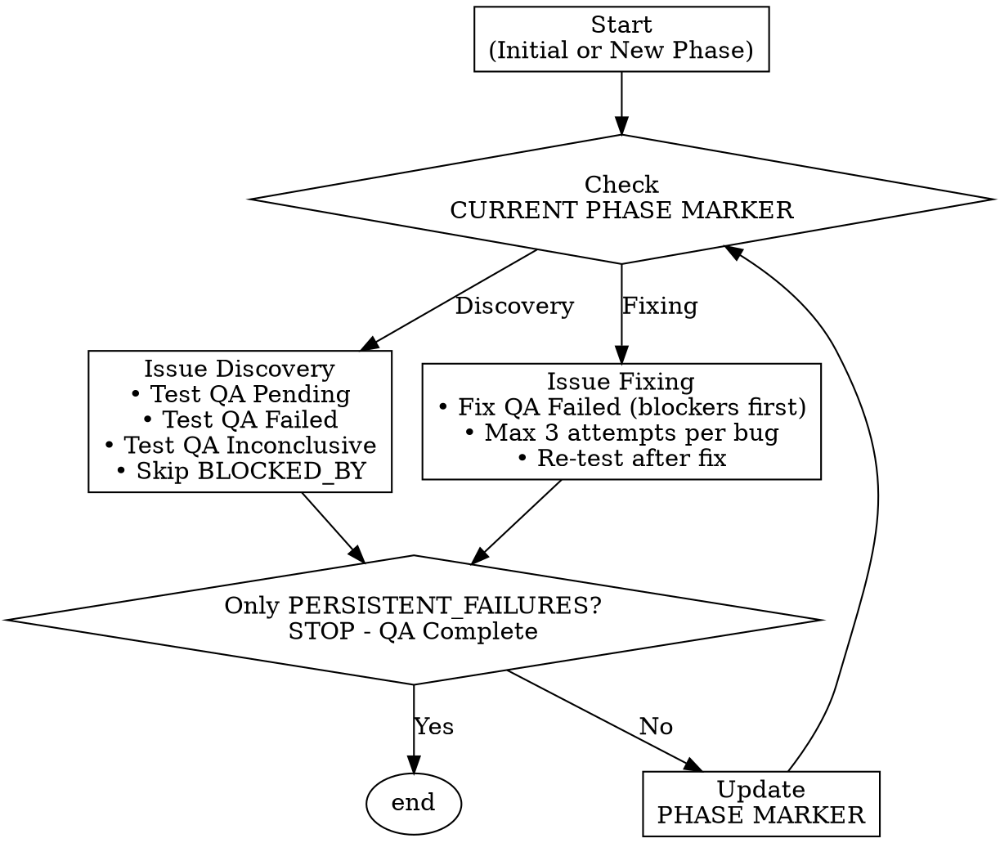

# Systematic QA Testing

## Overview
Iterative 2-phase QA loop: **Issue Discovery** (find problems) → **Issue Fixing** (fix problems) → repeat until only PERSISTENT_FAILURES remain. Prevents infinite loops with 3-attempt limits and blocker dependency management.

## When to Use
- Setting up QA process for new features
- Executing manual test suites
- Managing test dependencies and blockers
- Tracking bug fix attempts
- Handling unfixable bugs

## 2-Phase Loop



## Status Labels

| Status | Meaning | When to Use |
|--------|---------|-------------|
| `QA Pending` | Not tested yet | Initial state, or reset after unblocking |
| `QA Failed` | Test failed, bug found | During Discovery when test fails |
| `QA Success` / `QA Pass` | Test passed | After successful test execution |
| `QA Inconclusive` | Test attempted, unclear result | Re-test in next Discovery phase |
| `BLOCKER` | Blocks other tests | Test failure prevents dependent tests |
| `BLOCKED_BY: {test-id}` | Cannot run until blocker fixed | Mark dependent tests |
| `PERSISTENT_FAILURE` | Failed after 3 fix attempts | Add to PERSISTENT_FAILURES.md |

## Initial Setup

Create `QA_PROCESS.md`:

```markdown
## QA Process

2-phase iterative loop:
1. Issue Discovery: Execute pending/failed/inconclusive tests
2. Issue Fixing: Fix failed tests (blockers first, max 3 attempts)

Repeat until only PERSISTENT_FAILURES remain.

---------------------------
CURRENT PHASE MARKER: Issue Discovery
---------------------------

Last [Phase Name] completed: [Date]
- **Action**: [What was done]
- **Bugs Fixed**: Bug #N, #M...
- **Tests Updated**: [Test IDs and new statuses]
- **Commits**: [Hashes]
```

Create test document with test cases using format:

```markdown
### Test [ID]: [Name] - [Platform]

**Status**: QA Pending

**Prerequisites**:
- [Required conditions]

**Steps**:
1. [Action]
2. [Verification]

**Expected Results**:
- ✅ [Expected outcome]

**QA Results**: [FILL DURING TESTING]
```

## Issue Discovery Phase

###Execution Rules

1. **Which tests to run**:
   - ✅ Status = QA Pending, QA Failed, QA Inconclusive
   - ❌ Skip: Status = BLOCKED_BY

2. **During testing**:
   - Document results inline in `**QA Results**:` section
   - If test fails:
     - Mark as `QA Failed`
     - Create Bug #N
     - If blocks other tests: Add `BLOCKER` label, mark dependents as `BLOCKED_BY: Test X`

3. **After all tests**:
   - Update phase marker to "Issue Fixing"
   - Document phase completion

## Issue Fixing Phase

### Execution Rules

1. **Priority order**: Fix tests with `BLOCKER` label first, then others

2. **3-Attempt Rule** (per bug):
   ```
   Attempt 1: [Approach] → [Result]
   Attempt 2: [Different approach] → [Result]
   Attempt 3: [Final approach] → [Result]

   If still failing after attempt 3:
   → Mark as PERSISTENT_FAILURE
   → Document in {test-doc}-PERSISTENT_FAILURES.md
   → Keep QA Failed + add PERSISTENT_FAILURE label
   → Move to next bug
   ```

3. **After fixing a bug**:
   - Re-test the original test
   - If passes: Mark as `QA Success`
   - If test was `BLOCKER`: Remove `BLOCKED_BY` from dependent tests, reset to `QA Pending`
   - If still fails: Count as next attempt

4. **After all bugs**:
   - Update phase marker to "Issue Discovery"
   - Document phase completion

## Blocker Handling

**Identifying blockers**:
- Test X fails during Discovery
- Test Y requires Test X to pass
- Action: Mark Test X as `BLOCKER`, mark Test Y as `BLOCKED_BY: Test X`

**Removing blockers**:
- After fixing and re-testing Test X:
  - If Test X now passes: Remove `BLOCKER` label
  - Find all tests marked `BLOCKED_BY: Test X`
  - Remove `BLOCKED_BY` label
  - Reset to `QA Pending`

**Never**: Test BLOCKED_BY tests ("might work anyway") - wastes time

## PERSISTENT_FAILURE Template

Create `{test-doc}-PERSISTENT_FAILURES.md`:

```markdown
## Test [ID]: [Name]

**Bug #N**: [Description]

**Attempts**:
1. [Date] [Approach] - [Why failed]
2. [Date] [Approach] - [Why failed]
3. [Date] [Approach] - [Why failed]

**Root Cause**: [Best understanding]

**Recommendation**: [Escalate/Defer/Workaround]

**Impact**: [What functionality is affected]
```

## Common Mistakes

| Mistake | Fix |
|---------|-----|
| "Let me test BLOCKED_BY tests anyway" | NO. Skip them. Wastes time. |
| "I'll try just one more approach" (attempt 4+) | NO. 3 attempts max. Mark PERSISTENT_FAILURE. |
| "I'll fix the easy bugs first" | NO. Fix BLOCKERS first (unblocks dependents). |
| "5-phase waterfall process" | NO. 2-phase loop only (Discovery ↔ Fixing). |
| "Let me re-test QA Failed during Discovery" | NO. Re-testing happens in Fixing phase only. |
| "I'll create 10 documentation files" | NO. Start simple (1-2 files). Expand as needed. |

## Red Flags - STOP

- More than 3 attempts on same bug → Mark PERSISTENT_FAILURE
- Testing BLOCKED_BY tests → Skip them
- Phase marker not updated → Update it
- No blocker prioritization → Fix blockers first
- Creating complex docs upfront → Start simple

**All violations mean**: Follow the 2-phase loop, respect attempt limits, prioritize blockers.